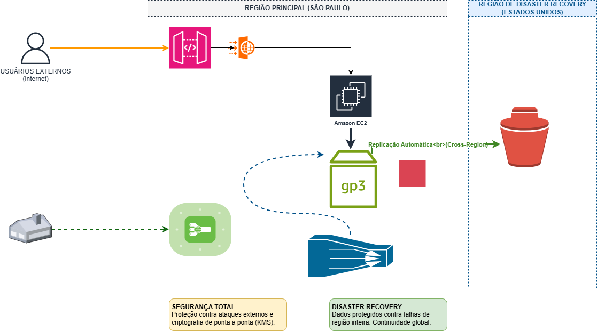

# ☁️ Arquitetura AWS Resiliente: Proteção de Dados, Conectividade e Disaster Recovery

Este repositório contém a solução arquitetural para o **Desafio GFT**, focada em alta disponibilidade, segurança de borda, governança de backups e resiliência geográfica (Disaster Recovery) utilizando serviços da Amazon Web Services (AWS).

O projeto foi desenhado utilizando o **Draw.io** e estruturado para demonstrar visualmente tanto o valor técnico para equipes de engenharia quanto os pilares de continuidade de negócios para a gestão executiva.

---

## 🗺️ O Diagrama da Arquitetura

O arquivo fonte interativo está disponível neste repositório como `arquitetura-desafio-gft.html`. 

> 💡 **Como visualizar ou editar o diagrama:**
> 1. Baixe o arquivo `arquitetura-desafio-gft.html` deste repositório.
> 2. dê um duplo clique nele para visualizar a arquitetura direto no seu navegador.
> 3. Se quiser editar, basta acessar o [Draw.io](https://app.diagrams.net/) e **arrastar e soltar** o arquivo `.html` para dentro da tela quadriculada.

*(Opcional: Se você exportar o diagrama como imagem, pode exibi-la diretamente aqui substituindo a linha abaixo)*

---

## 🎯 Pilares Estratégicos do Projeto

### 1. Segurança de Borda e Acesso Privado
* **AWS API Gateway + WAF:** Centraliza as requisições externas e atua como a primeira linha de defesa, bloqueando ataques maliciosos (como OWASP Top 10) antes que atinjam os servidores de aplicação.
* **AWS Site-to-Site VPN:** Garante que todo o tráfego administrativo e de gestão interna seja realizado por um túnel criptografado privado, eliminando a exposição de portas sensíveis na internet pública.

### 2. Camada de Dados, Performance e Otimização
* **Amazon EC2 & EBS (gp3):** Os servidores executam as aplicações de negócio utilizando volumes EBS de última geração (`gp3`). Essa escolha permite escalar IOPS e throughput de forma independente, otimizando os custos em até 20% em comparação à geração anterior (`gp2`).
* **AWS KMS (Key Management Service):** Garante conformidade com políticas de segurança e privacidade (como a LGPD). Todos os dados do volume EBS são criptografados em repouso e em trânsito.

### 3. Governança e Disaster Recovery (DR)
* **Amazon DLM (Data Lifecycle Manager):** Automação total do ciclo de vida dos backups (criação, retenção e descarte de snapshots), eliminando o risco de erro ou esquecimento humano.
* **Replicação Cross-Region:** Os snapshots dos volumes críticos são copiados automaticamente para uma segunda região geográfica isolada. Isso garante que, mesmo em um cenário de falha catastrófica regional, os dados do negócio estejam salvos e prontos para recuperação.

---

## 📊 Métricas de Continuidade de Negócio (Alvos de SLA)

Para validar a eficiência da arquitetura frente à gestão, o desenho foi projetado para atender aos seguintes objetivos:

* **RTO (Recovery Time Objective):** Menor que 15 minutos. Tempo máximo estimado para restabelecer o funcionamento do ambiente na região de Disaster Recovery após uma falha crítica.
* **RPO (Recovery Point Objective):** Menor que 5 minutos. Janela máxima tolerada para perda de dados históricos, garantida pela alta frequência de snapshots incrementais e automatizados.

---

## 🛠️ Tecnologias Representadas

* **Camada de Borda/Rede:** AWS API Gateway, AWS WAF, AWS Site-to-Site VPN.
* **Camada de Computação:** Amazon EC2.
* **Camada de Armazenamento:** Amazon Elastic Block Store (EBS gp3).
* **Camada de Segurança/Backup:** AWS KMS, Amazon Data Lifecycle Manager (DLM), Cross-Region Snapshot Copy.

---

